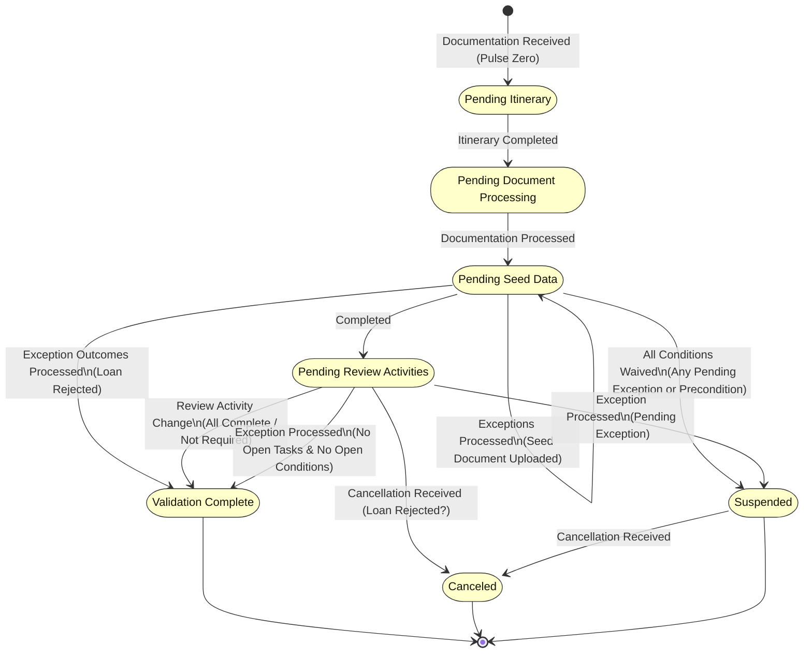

```mermaid
stateDiagram-v2
    %% Initial pseudo-state
    [*] --> PendingItinerary: Documentation Received (Pulse Zero)

    %% Main states
    state "Pending Itinerary" as PendingItinerary
    state "Pending Document Processing" as PendingDocProc
    state "Pending Seed Data" as PendingSeedData
    state "Pending Review Activities" as PendingReview
    state "Validation Complete" as ValidationComplete
    state "Suspended" as Suspended
    state "Canceled" as Canceled

    %% Transitions
    PendingItinerary --> PendingDocProc: Itinerary Completed
    PendingDocProc --> PendingSeedData: Documentation Processed

    %% From Pending Seed Data
    PendingSeedData --> PendingReview: Completed
    PendingSeedData --> ValidationComplete: Exception Outcomes Processed\n(Loan Rejected)
    PendingSeedData --> Suspended: All Conditions Waived\n(Any Pending Exception or Precondition)
    PendingSeedData --> PendingSeedData: Exceptions Processed\n(Seed Document Uploaded)

    %% From Pending Review Activities
    PendingReview --> ValidationComplete: Review Activity Change\n(All Complete / Not Required)
    PendingReview --> Suspended: Exception Processed\n(Pending Exception)
    PendingReview --> Canceled: Cancellation Received (Loan Rejected?)
    PendingReview --> ValidationComplete: Exception Processed\n(No Open Tasks & No Open Conditions)

    %% Potential transitions out of Suspended or Canceled
    Suspended --> Canceled: Cancellation Received

    %% Final or terminal states
    ValidationComplete --> [*]
    Canceled --> [*]
    Suspended --> [*]

    %% Style each state to appear oval-like (increasing rx/ry rounds corners)
    style PendingItinerary fill:#ffffcc,stroke:#333,stroke-width:1px,rx:30,ry:30
    style PendingDocProc fill:#ffffcc,stroke:#333,stroke-width:1px,rx:30,ry:30
    style PendingSeedData fill:#ffffcc,stroke:#333,stroke-width:1px,rx:30,ry:30
    style PendingReview fill:#ffffcc,stroke:#333,stroke-width:1px,rx:30,ry:30
    style ValidationComplete fill:#ffffcc,stroke:#333,stroke-width:1px,rx:30,ry:30
    style Suspended fill:#ffffcc,stroke:#333,stroke-width:1px,rx:30,ry:30
    style Canceled fill:#ffffcc,stroke:#333,stroke-width:1px,rx:30,ry:30


```
